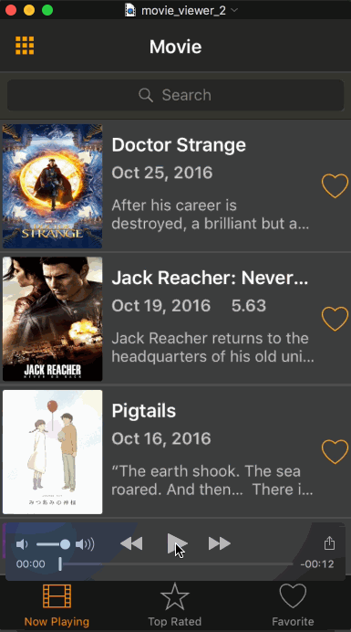

# Project 1 - *Movie Viewer*

**Movie Viewer** is a movies app using the [The Movie Database API](http://docs.themoviedb.apiary.io/#).

Time spent: **20** hours spent in total

## User Stories

The following **required** functionality is completed:

- [X] User can view a list of movies currently playing in theaters. Poster images load asynchronously.
- [X] User can view movie details by tapping on a cell.
- [X] User sees loading state while waiting for the API.
- [X] User sees an error message when there is a network error.
- [X] User can pull to refresh the movie list.

The following **optional** features are implemented:

- [X] Add a tab bar for **Now Playing** and **Top Rated** movies.
- [X] Implement segmented control(Switch Icon) to switch between list view and grid view.
- [X] Add a search bar.
- [X] All images fade in.
- [ ] For the large poster, load the low-res image first, switch to high-res when complete.
- [X] Customize the highlight and selection effect of the cell.
- [X] Customize the navigation bar.

The following **additional** features are implemented:

- [X] User can like or unlike a movie
- [X] User can watch movie trailers
- [X] Use Realm to persist data locally
- [X] Design icons and logos using Sketch
- [X] Add placeholder image for loading and movies that don't have a poster

## Libraries and tools used
- [AFNetworking](https://github.com/AFNetworking/AFNetworking) - A delightful networking framework for iOS, OS X, watchOS, and tvOS.
- [Realm](http://realm.io) - Realm is a mobile database: a replacement for SQLite & ORMs.
- [MBProgressHUD](https://github.com/jdg/MBProgressHUD) - MBProgressHUD is an iOS drop-in class that displays a translucent HUD with an indicator and/or labels while work is being done in a background thread.

## Video Walkthrough 

Here's a walkthrough of implemented user stories:

GIF created with [LiceCap](http://www.cockos.com/licecap/).

## License

    Copyright 2016 Zhaolong Zhong

    Licensed under the Apache License, Version 2.0 (the "License");
    you may not use this file except in compliance with the License.
    You may obtain a copy of the License at

        http://www.apache.org/licenses/LICENSE-2.0

    Unless required by applicable law or agreed to in writing, software
    distributed under the License is distributed on an "AS IS" BASIS,
    WITHOUT WARRANTIES OR CONDITIONS OF ANY KIND, either express or implied.
    See the License for the specific language governing permissions and
    limitations under the License.